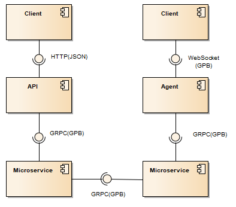
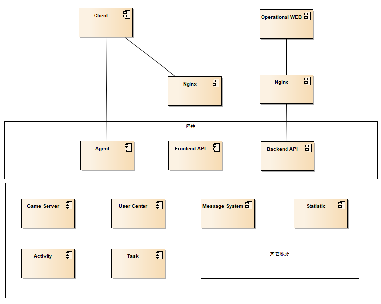

# yivgame
Yivgame is a microservice game server base on go-kit

## 特性
* 微服务架构
* 客户端与游戏服务器实现双向流透传
* websocket通信
* 实现 http endpoints 和 websocket endpoints 度量衡
## 设计实践
* 实现游戏核心业务、用例、接口和设施分层模型（参考领域模型）
* 包采用单向依赖，外层可依赖内层，内层不可依赖外层（从外到内分别为：设施、接口、用例和业务），业务层仅依赖了标准库包
* 使用包偏平化布局
* 无全局变量，内层对基础设施的依赖通过接口定义，由外层实现，在创建时通过参数注入
## 模型
### 通信图

### 服务组件图

## 设施依赖
* docker：所有依赖设施服务和游戏实例通过docker社区版进行布署
* rockcoach：作为持久化数据库
* kafka：作为message queue和stream platform
* etcd：用于服务发现
* gogs：使用gogs进行版本管理
## 系统环境
* Ubuntu Server 16.04

## 参考
* [go-kit](https://github.com/go-kit/kit): yivgame基于go-kit开发
* [goddd](https://github.com/marcusolsson/goddd): 一个用go写的基于领域模型的样例APP
* [Practical Persistence in Go: Organising Database Access](http://www.alexedwards.net/blog/organising-database-access https://zuozuohao.github.io/2016/06/16/Practical-Persistence-in-Go-Organising-Database-Access)
* [The Clean Architecture](https://8thlight.com/blog/uncle-bob/2012/08/13/the-clean-architecture.html)
* [Applying The Clean Architecture to Go applications](http://manuel.kiessling.net/2012/09/28/applying-the-clean-architecture-to-go-applications/)